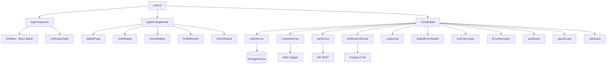
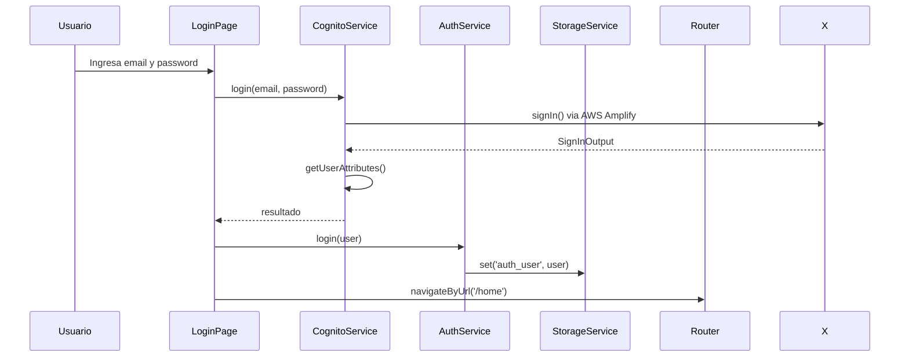
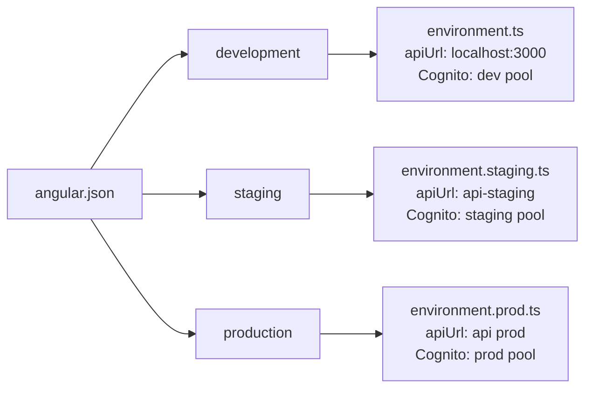

 # Arquitectura — DriverApp

## Diagrama de módulos



## Flujo de autenticación



## Flujo de guards

```mermaid
flowchart LR
    Nav[Navegación] --> AG{authGuard}
    AG -->|Autenticado| Page[Página protegida]
    AG -->|No autenticado| Login[/auth/login]

    Nav2[Navegación] --> GG{guestGuard}
    GG -->|No autenticado| LoginPage[Página de login]
    GG -->|Autenticado| Home[/home]

    Nav3[Navegación /admin] --> AG2{authGuard}
    AG2 -->|Autenticado| RG{roleGuard admin}
    RG -->|Es admin| Admin[Panel Admin]
    RG -->|No es admin| Home2[/home]
    AG2 -->|No autenticado| Login2[/auth/login]
```

## Estructura de ambientes


